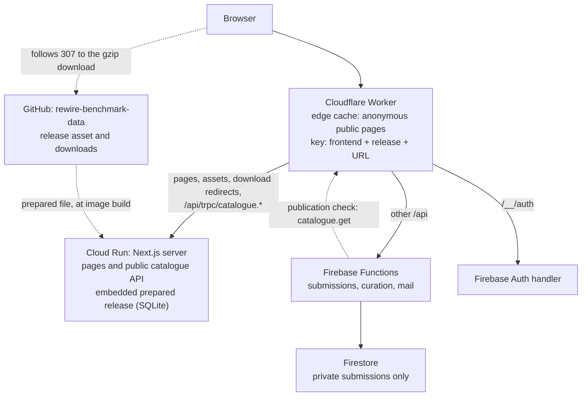

# Rewire benchmark website

The benchmark frontend and public query/contribution API. Scientific records, source evidence, ingestion and immutable release generation live in [rewire-benchmark-data](https://github.com/rewire-bio/rewire-benchmark-data). Benchmark execution lives in [rewire-benchmarks](https://github.com/rewire-bio/rewire-benchmarks); articles live in [rewire.it](https://github.com/rewire-bio/rewire.it).

## Architecture



| Component | Owns | Released by |
| --- | --- | --- |
| `benchmark-data.lock.json` | The reviewed data pin: producer revision, manifest SHA-256, release ID, and the prepared file's release tag, name and SHA-256 | A pull request changing the lock |
| Next.js server (`app/`, `lib/`, `components/`) | Rendering every page on request and the public catalogue API (`app/api/trpc/[trpc]/route.ts`) | A new image on Cloud Run |
| Container entrypoint (`scripts/server-entry.mjs`) | Checking the embedded release before starting | Part of the image |
| Firebase Functions (`services/omics`) | Submissions, curation and mail | `firebase deploy --only functions:omics,firestore` |
| Firestore | Private submissions, revisions, outbox and rate limits | The Functions above |
| Cloudflare Worker (`cloudflare/`) | Routing, legacy redirects, edge cache | `wrangler deploy`, only when Worker code changes |
| GitHub (`rewire-benchmark-data`) | The prepared release file (a release asset) and download bytes | The data repository |

### One release per image

The producer publishes each release as one SQLite file (tag `serving/<release>`, see [its serving contract](https://github.com/rewire-bio/rewire-benchmark-data/blob/main/docs/serving-contract.md)). It holds the query engine's answers, computed once per release: record details, result and evidence rows, list search entries, summaries, use cases and audits. The lock pins it by SHA-256.

`npm run data:prepare` downloads and verifies the file into `serving/`. `scripts/build-web.mjs` copies it and the few small files pages render into `build/web/data/`, checks its digest against the lock and refuses any other release data in the image. At startup the entrypoint checks that the embedded lock, the producer manifest and the file's `meta` table name the same release, then starts the unmodified Next standalone server. It downloads nothing.

- **Pages** read the file through `shared/omics/prepared-catalogue.ts` (`lib/prepared.ts`). A request reads only the rows it needs; no page parses the whole catalogue or builds an index.
- **The public catalogue API** (`/api/trpc/catalogue.*`) runs in the same server over the same reader, so pages and API cannot disagree. A request pinned to another release gets a 404 naming the current one.
- **Downloads** are site paths (`/omics/...`, `/benchmark-literature/...`). The server redirects each to the exact gzip `source` the pinned manifest lists, and returns 404 for anything it does not list.

Nothing is prerendered at build time. Next builds against an empty data directory, so a build that tries to read release data fails.

### Edge cache

The Worker caches only anonymous `GET` requests for public paths, and only stores a response that:

- the origin explicitly opted in (`X-Rewire-Edge-Cache: public`, set by `middleware.ts`);
- has status 200, HTML or static-asset content (never `text/x-component`) and no `Set-Cookie`;
- varies only on Next navigation headers or `Accept-Encoding` (`Vary: *` or any other field bypasses);
- carries the same `X-Rewire-Frontend` and `X-Rewire-Data-Release` as its key.

These requests always bypass the cache: cookies, `Authorization`, RSC, prefetch, router-state, `Next-Url` and server-action headers, `?_rsc=`, non-GET methods, `/api`, `/__/auth`, `/contribute`, `/_analytics`, downloads and the publication receipts. The Worker learns the identity from origin responses (for up to 60 s), so a new image or data release starts a new key space without redeploying the Worker. Eviction only means a re-render. Failed cache reads or writes never fail a response. Browsers revalidate HTML on every request; `/_next/static` assets are immutable.

## Development

Requires Node.js 22 or newer (CI uses 24). The public data repository is fetched over HTTPS; no personal token or SSH key is required.

```sh
npm ci
npm run data:fetch
npm run dev            # next dev over the prepared file in serving/
```

`npm run data:prepare -- --current-only` verifies and hydrates the pinned current release into `data/` and `public/omics/`, and downloads the prepared file into `serving/` (all ignored). Use `BENCHMARK_DATA_SOURCE=/path/to/rewire-benchmark-data` to consume an existing checkout at the pinned revision.

```sh
npm test
npm run lint
npm run typecheck
npm --prefix services/omics run build && npm --prefix services/omics test
npm run omics:service:test    # with the Firebase emulators (Java 21)
npm run check:data            # release data integrity of the hydrated pin
npm run build                 # standalone server in build/web
npm run check:build           # runs build/web as Cloud Run does, over HTTP
npm start                     # local production preview on http://127.0.0.1:3000
```

`npm run check:build` validates the release data directly (records, use cases and sources, research sidecars, evidence exports, archive checksums, baseline audits, page route inventory). It then starts the built server through its entrypoint. It checks identity and cache headers, RSC isolation, absent pages (404), download redirects, receipts, private routes, the exact sitemap, and the search metadata of one page per record kind and alias route plus the index and utility pages. `npm run check:build:full` renders every record page as an optional audit.

## Releases

Each kind of change has its own path. The publication workflow (`.github/workflows/firebase.yml`) selects the path from fingerprints of the change, and publication stays serialized.

| Change | What runs | Image build |
| --- | --- | --- |
| Frontend code | Build image, deploy candidate revision | Yes |
| Data (the lock) | Build an image embedding the new prepared file, deploy candidate revision | Yes |
| The submission function (`services/omics/`) | `firebase deploy --only functions:omics,firestore` | No |
| Shared code (`shared/omics/`: query engine, prepared reader, schemas, use cases) | A new image | Yes |
| Worker | `wrangler deploy --var FRONTEND_ORIGIN:<run.app URL>` | No |

Website changes never deploy the function. A test checks that the website imports nothing from `services/`.

Every image publication deploys a candidate revision with `--no-traffic`. The candidate is verified through its own tag URL (receipt, image and release headers, result, evaluation, model and benchmark pages, the catalogue API's release, the exact download redirect) before it receives traffic. The workflow then verifies the public site through Cloudflare. A failure after the traffic shift moves traffic back to the previous revision, and the Worker restores its own previous version. There is no data import or activation: rolling back the image rolls back the data.

A Worker- or backend-only change reuses the image of the revision serving traffic, read from that revision rather than from the service template, which after a rollback can name a failed candidate.

```sh
npm run deploy    # scripts/deploy-independent-frontend.mjs: run only by the publication workflow
```

The Cloud Run service is `rewire-database-web` in `europe-west2`. It uses request-based billing (`--cpu-throttling`), min 0 and max `CLOUD_RUN_MAX_INSTANCES` (default 3, at most 10) instances, unauthenticated ingress for the Worker, and no Google load balancer. See [docs/independent-frontend.md](docs/independent-frontend.md) for the one-time bootstrap and required configuration.

Make data edits in the data repository. New releases reach the site automatically:

1. rewire-benchmark-data's release workflow cuts a release from reviewed changes on its main branch (weekly or on demand) and publishes its prepared file as `serving/<release>`.
2. `.github/workflows/adopt-data-release.yml` here runs hourly (or on dispatch). If a newer prepared release is published, it points the lock at the commit that published it, runs `npm run shared:sync` from that commit, runs lint, typecheck, tests, `check:data`, the production build and `check:build`, commits `Adopt data release <id>` to main and starts the deployment workflow.
3. The deployment verifies a candidate revision before traffic and rolls back on failure, as for any change. Run "Adopt the newest data release" by hand with a release ID to adopt a specific release; it never moves to an older one.

After each accepted publication, the deployment deletes every Cloud Run revision and tag except the serving revision and the one it replaced. Old images are removed by the Artifact Registry cleanup policy on `rewire-web` (keep the five newest).

## Code layout

- `app/`, `components/`, `lib/`: the Next.js website and public catalogue API.
- `shared/omics/`: a copy of rewire-benchmark-data's `services/omics/src` (record validation, query engine, prepared-file reader) as of the release the lock pins. Change it there; when a pull request adopts a new release, also run `npm run shared:sync -- /path/to/rewire-benchmark-data` with that checkout at the new lock's revision. Its tests live in that repository.
- `services/omics/`: the self-contained Firebase function for submissions, curation and mail, with its own dependencies and emulator tests.
- `cloudflare/`: the Worker. `scripts/`: build, data, deployment and audit tools.

Keep private contributor data out of every public artifact.
